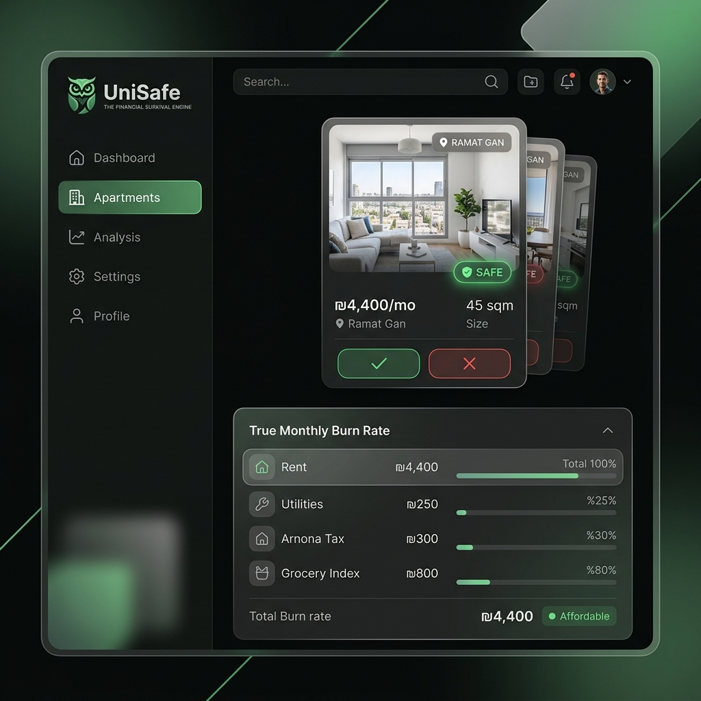
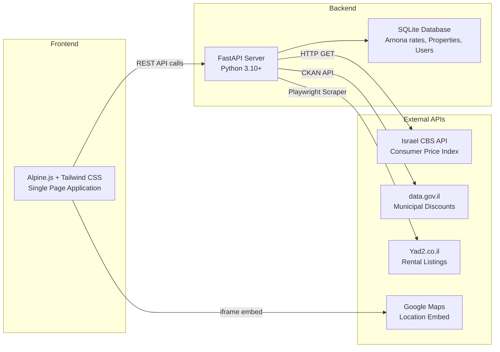

<p align="center">
  
</p>

<h1 align="center">UniSafe — The Financial Survival Engine</h1>

<p align="center">
  <strong>AI-powered apartment hunting platform for Israeli university students</strong><br>
  Real-time budget analysis · Yad2 &amp; Facebook scraping · Municipal tax calculations · Government data integration
</p>

<p align="center">
  
  
  
  
  
  
</p>

---

## 📸 Demo

<p align="center">
  
</p>

---

## 🔍 What is UniSafe?

**UniSafe** is a full-stack web platform that helps Israeli university students find affordable housing while staying financially safe. It scrapes real rental listings from **Yad2** and **Facebook Marketplace**, calculates the **true monthly cost** (rent + utilities + Arnona municipal tax + grocery index), and tells students whether a property fits within their budget using a **65% safety ceiling** methodology.

The platform integrates with **Israel's Central Bureau of Statistics (CBS) API** for live CPI data, **data.gov.il** for municipal discount eligibility, and **Google Maps** for location visualization — all in a premium dark-mode UI with Tinder-style swipe mechanics.

---

## ✨ Features

| Feature | Description |
|:--------|:------------|
| 🏠 **Smart Property Matching** | Tinder-style swipe cards with real rental listings |
| 📊 **True Burn Rate Calculator** | Rent + Utilities + Arnona + CPI-adjusted grocery costs |
| 🔍 **Live Yad2 Scraper** | Playwright-powered scraper with anti-bot bypass + fallback simulation |
| 📱 **Facebook Marketplace** | Integrated Facebook rental listings |
| 🏛️ **Government API Integration** | Real-time student discount eligibility via data.gov.il |
| 📈 **CBS CPI Index** | Live Consumer Price Index from Israel Bureau of Statistics |
| 🗺️ **Google Maps** | Interactive map pinpointing each property location |
| 🔐 **Landlord Verification** | Verify landlord ownership via Government Land Registry (Tabu) |
| 💳 **Subscription Tiers** | Free (10 swipes) · Premium (50 swipes/₪20) · VIP (Unlimited/₪500) |
| 🌙 **Premium Dark Mode UI** | Glassmorphism design with smooth micro-animations |

---

## 🏗️ Architecture



---

## 📁 Project Structure

```
UniSafe/
├── backend/
│   ├── main.py              # FastAPI app — all API endpoints + CORS
│   ├── init_db.py           # Database schema creation & seed data
│   ├── cbs_client.py        # Israel CBS CPI API integration
│   ├── yad2_scraper.py      # Playwright Yad2 scraper + fallback simulator
│   ├── test_endpoints.py    # Endpoint integration tests
│   └── requirements.txt     # Python dependencies
│
├── frontend/
│   ├── index.html           # Main SPA (Alpine.js reactive dashboard)
│   └── images/
│       ├── unisafe_logo.png # Brand logo (owl mascot)
│       └── comfort_choice.png
│
├── docs/
│   └── demo_screenshot.png  # App demo screenshot
│
├── .github/
│   └── workflows/
│       └── ci.yml           # GitHub Actions CI pipeline
│
├── run.bat                  # One-click Windows startup script
├── ad_page.html             # Marketing landing page
├── CONTRIBUTING.md          # Contribution guidelines
├── .gitignore               # Git ignore rules
├── LICENSE                  # MIT License
└── README.md                # This file
```

---

## 🚀 Quick Start

### Prerequisites

- **Python 3.10+** — [Download here](https://www.python.org/downloads/)
- **Git** — [Download here](https://git-scm.com/downloads)
- A modern web browser (Chrome, Edge, Firefox)

### Option 1: One-Click (Windows)

```bash
git clone https://github.com/Yair-fr/UniSafe.git
cd UniSafe
```

Double-click **`run.bat`** — that's it! The script will automatically:

1. ✅ Create a Python virtual environment
2. ✅ Install all pip dependencies
3. ✅ Initialize & seed the SQLite database
4. ✅ Start the FastAPI server on `http://127.0.0.1:8000`

### Option 2: Manual Setup (Any OS)

```bash
git clone https://github.com/Yair-fr/UniSafe.git
cd UniSafe/backend

# Create & activate virtual environment
python -m venv venv
# Windows:
venv\Scripts\activate
# macOS/Linux:
source venv/bin/activate

# Install dependencies
pip install -r requirements.txt

# Initialize database
python init_db.py

# Start the server
python -m uvicorn main:app --host 127.0.0.1 --port 8000
```

Then open **http://127.0.0.1:8000** in your browser 🎉

---

## 🔌 API Reference

| Method | Endpoint | Description |
|:-------|:---------|:------------|
| `GET` | `/api/properties?city=Ramat+Gan&budget=4500` | Fetch rental listings (live scrape + fallback) |
| `POST` | `/api/evaluate` | Calculate true burn rate for properties |
| `GET` | `/api/user?username=student_user` | Get user subscription status |
| `POST` | `/api/subscribe` | Update subscription tier (`free` / `premium` / `vip`) |
| `POST` | `/api/swipe` | Record a swipe action (enforces daily limits) |
| `GET` | `/api/cpi-index` | Get latest CPI multiplier from Israel CBS |
| `GET` | `/api/municipal/discount-check` | Check Arnona student discount eligibility |
| `POST` | `/api/landlords/verify` | Verify landlord via Government Land Registry (Tabu) |
| `GET` | `/item/{id}` | Property detail page with map & burn breakdown |

---

## 🛠️ Tech Stack

| Layer | Technology | Purpose |
|:------|:-----------|:--------|
| **Backend** | [FastAPI](https://fastapi.tiangolo.com/) | Async REST API framework |
| **Database** | [SQLite](https://www.sqlite.org/) | Local relational database |
| **Scraping** | [Playwright](https://playwright.dev/) | Headless browser for Yad2 |
| **Frontend** | [Alpine.js](https://alpinejs.dev/) | Lightweight reactive framework |
| **Styling** | [Tailwind CSS](https://tailwindcss.com/) | Utility-first CSS |
| **Maps** | [Google Maps Embed](https://developers.google.com/maps) | Location visualization |
| **Gov APIs** | [data.gov.il](https://data.gov.il/) | Municipal open data |
| **CPI Data** | [Israel CBS API](https://www.cbs.gov.il/) | Consumer Price Index |

---

## 📊 How the Burn Rate Works

```
Total Monthly Burn = Rent + Utilities + Arnona (after discount) + CPI-adjusted Grocery Index
```

**Safety Check:**

- ✅ `Total Burn ≤ 65% of Monthly Budget` → **SAFE**
- ❌ `Total Burn > 65% of Monthly Budget` → **AT RISK**

**Arnona Calculation:**

1. Fetch rate per sqm from local database (per city + zone)
2. Query data.gov.il for student discount eligibility
3. Apply Ministry of Interior discount brackets
4. Scale by property size → monthly amount

**CPI Adjustment:**

- Live query to Israel CBS API for latest Consumer Price Index
- Fallback multiplier of `1.05` if API is unreachable

---

## 🤝 Contributing

Contributions are welcome! Please see [CONTRIBUTING.md](CONTRIBUTING.md) for guidelines.

---

## 🎓 Built For

This project was developed as part of the **Artificial Intelligence: Practical Applications** course at **Bar-Ilan University** (BIU), Semester B 2026.

---

## 📄 License

This project is licensed under the **MIT License** — see the [LICENSE](LICENSE) file for details.

---

<p align="center">
  <br>
  <sub>Made with 🦉 by the UniSafe Team</sub>
</p>
